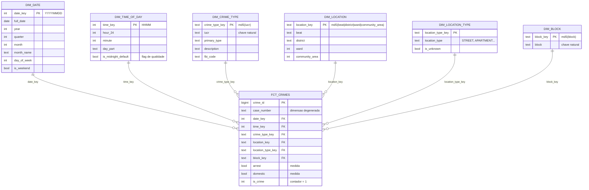
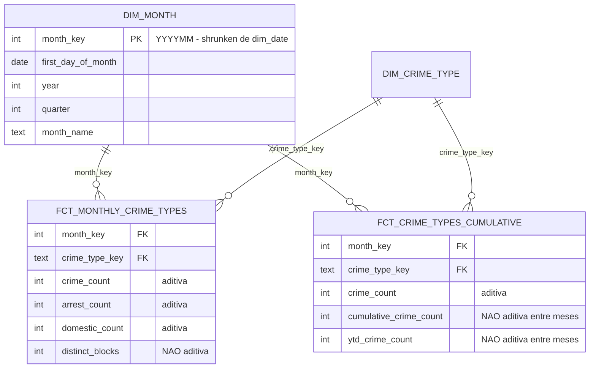
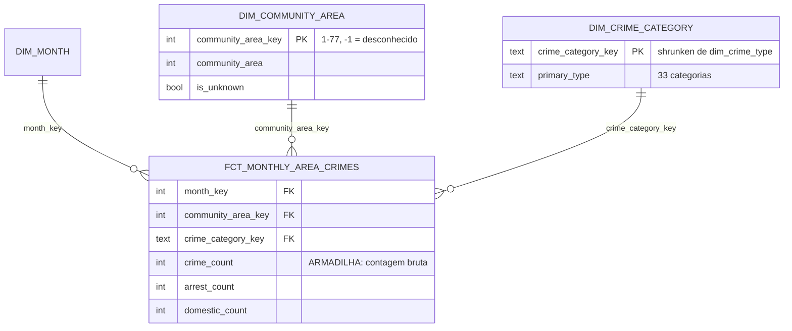
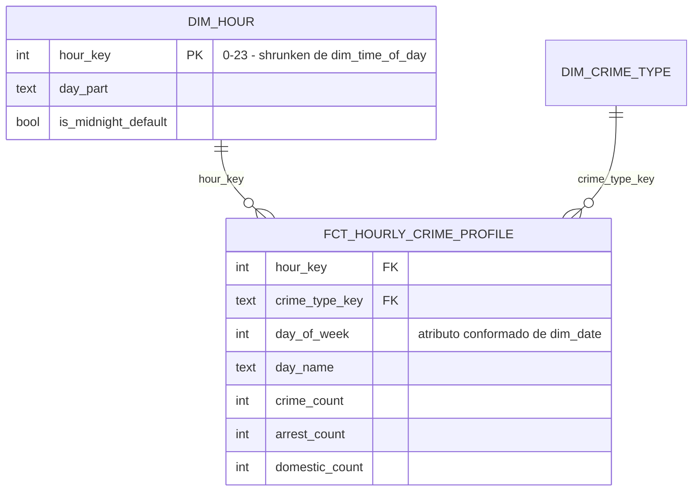
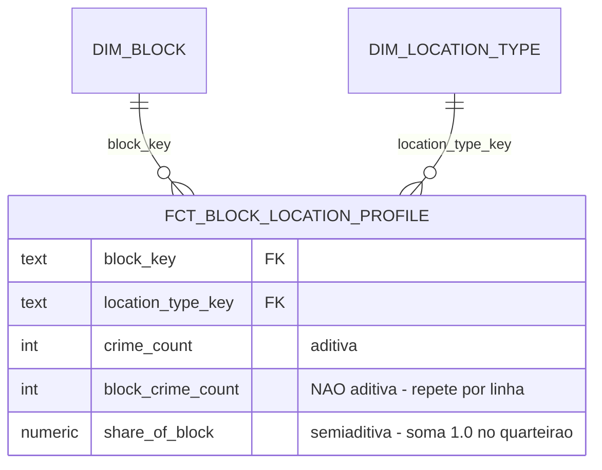
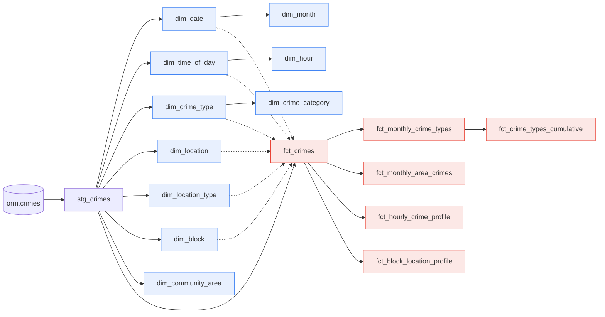

# Diagrama do Modelo Estrela

Os diagramas abaixo usam Mermaid e são renderizados nativamente pelo GitHub/GitLab.

---

## 1. Estrela principal — `fct_crimes` (fato de transação)

Grão: **uma ocorrência criminal reportada** (8.587.983 linhas).

**Cardinalidades:** `dim_date` 9.311 · `dim_time_of_day` 1.440 · `dim_crime_type`
418 · `dim_location` 2.446 · `dim_location_type` 219 · `dim_block` 65.968.

---

## 2. Estrelas derivadas

Todos os fatos abaixo são construídos **a partir de `fct_crimes`** e usam
**dimensões conformadas** (as *shrunken* estão marcadas).

### 2.1 `fct_monthly_crime_types` — snapshot periódico
### 2.2 `fct_crime_types_cumulative` — snapshot cumulativo

### 2.3 `fct_monthly_area_crimes` — snapshot periódico geográfico

### 2.4 `fct_hourly_crime_profile` — perfil temporal (agregado)

### 2.5 `fct_block_location_profile` — perfil composicional (agregado)

---

## 3. Linhagem (DAG dbt)

Todo fato derivado nasce de `fct_crimes` — nunca do staging. É o que garante que
nenhuma tabela possa divergir do fato atômico.

> `fct_crime_types_cumulative` deriva de `fct_monthly_crime_types` (e não
> diretamente do fato atômico) porque só precisa densificar e acumular um
> resultado que aquele snapshot já calculou.
